# How to use a systems diagram

Do not look at a diagram and say “I get it.” Cover the right half. For each arrow, predict the data type, shape, unit, source and whether gradients can cross it. Then reveal the next block. A diagram becomes understanding when you can reconstruct the implementation and name the failure created by breaking one arrow.

For every atlas plate:

1. Read the blocks left to right.
2. Write the contract at each arrow.
3. Trace one numerical example.
4. Mark observed, supplied, learned and generated values.
5. Mark training-only and deployment-available information.
6. Identify one invariant and one failure probe.
7. Locate the corresponding APEX source path.

# Plate 1: 1. Build a Simulator Before You Build a Neural Network

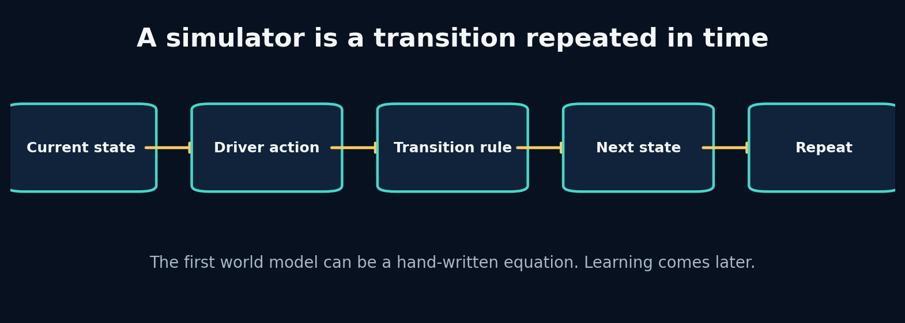

## What the picture is claiming

Understand simulation as repeated state transition, then build and inspect the smallest causal driving world.

A simulator stores a description of the world, receives an intervention, applies a transition, and returns a new description. In our first world, the state is only velocity and position. The action is a throttle value. The transition is an equation. Repeating the equation produces a rollout.

This hand-written simulator is already a world model in the broad engineering sense: it predicts a future state from a present state and an action. It is not a *learned* world model. That difference matters. A learned model replaces part of the transition rule with parameters estimated from evidence. The interface should remain stable: state in, action in, next state out.

Starting here gives us an oracle for later debugging. If a neural network predicts that stronger braking increases velocity, we can compare it with the toy causal rule and ask whether the data contract, target alignment, or learned relationship is broken.

## Label every block

- **State:** The minimum information carried from one step to the next. In APEX: Speed, progress, tyre state and other dynamic variables.
- **Action:** A controllable input applied during a transition. In APEX: Throttle, brake, steering and gear choices.
- **Transition:** The rule that maps current state and action to next state. In APEX: Hand-written physics, a GRU, an SSM or an RSSM.
- **Rollout:** Repeatedly applying the transition to create a future trajectory. In APEX: Imagining several seconds of future telemetry.

## Walk one value through it

Euler integration uses

\[v_{t+1}=v_t+a_t\Delta t\]

and

\[x_{t+1}=x_t+v_t\Delta t.\]

With \(v_t=20\), \(a_t=3\), and \(\Delta t=0.2\):

1. Velocity change: \(3\times0.2=0.6\) m/s.
2. Next velocity: \(20+0.6=20.6\) m/s.
3. Distance using the current velocity: \(20\times0.2=4.0\) m.
4. Next position, if starting at zero: 4.0 m.

A semi-implicit variant updates velocity first and then position, producing \(20.6\times0.2=4.12\) m. Neither is universally “the answer”; the numerical method is an implementation choice whose error shrinks with smaller time steps.

Now repeat the trace using one value from the packaged lab. Write its shape and unit before and after every transformation. If a block contains a learned model, distinguish its parameters from its temporary activation/state.

## What crosses each arrow?

Use this checklist:

- persistent state or temporary activation;
- observation, action, context, target or identifier;
- raw or normalized units;
- deterministic value or distribution parameters/sample;
- training-time evidence or deployment-time evidence;
- in-memory tensor or durable artifact reference.

## Break one arrow

Change `dt` from 0.1 to 1.0 without changing the acceleration profile. Compare the trajectory. Then update position with the newly computed velocity and compare again.

The first visible symptom may occur several blocks later. The debugging objective is to identify the earliest arrow whose actual contract differs from the diagram.

## Choosing a different route

- **Explicit Euler:** choose when you need the simplest transparent baseline and small time steps. Avoid when long unstable rollouts or stiff dynamics.
- **Semi-implicit Euler:** choose when velocity drives position and you want slightly better stability at similar cost. Avoid when you need high-order accuracy.
- **Runge–Kutta:** choose when the hand-written dynamics are smooth and numerical accuracy matters. Avoid when the transition is learned from discrete telemetry where solver precision is not the main bottleneck.

## APEX implementation map

```text
projects/01_car_integrator/main.py
apex_engine/src/apexsim/data/synthetic.py
apex_engine/src/apexsim/simulation.py
```

Open those files and redraw the diagram with exact function names and tensor shapes. Then add one missing production block—validation, logging, registry, monitoring or UI provenance—that the conceptual diagram intentionally omits.

## Explain it without vocabulary

Explain the plate to a five-year-old using objects moving through boxes. Then explain it to an engineer using contracts, shapes, units and failure modes. If both explanations are accurate, the idea is becoming durable.


# Plate 2: 2. State, Action, Context and the Markov Question

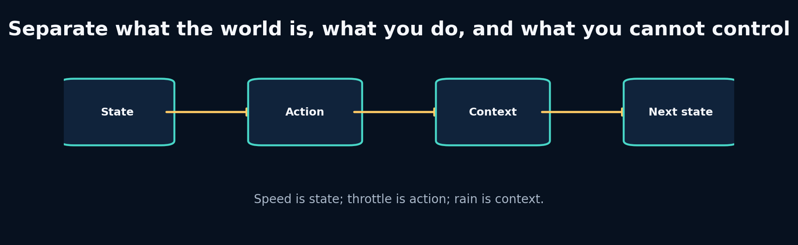

## What the picture is claiming

Design a causal telemetry schema and discover when the visible state is insufficient for predicting the future.

State is the information the transition needs to carry. Action is the intervention being chosen. Context changes the transition but is not controlled by the agent inside the model. Identifiers describe an entity or grouping and should not automatically become numeric features.

The Markov property says the next state is conditionally independent of the distant past once the present state and action are known. Real telemetry is rarely perfectly Markov. Tyre temperature, fuel mass, setup, and previous cornering load may be hidden. A recurrent model compensates by compressing history into memory. But recurrence is not permission to ignore schema design: hidden memory cannot recover information that was never observed.

A practical state contract should be sufficient, measurable, stable across data sources, and safe to use at inference time. A variable known only after the race cannot be an input to an online simulator.

## Label every block

- **Markov state:** A state that contains enough information to predict the next transition when combined with the action. In APEX: The ideal telemetry state; approximated using features plus history.
- **Context:** An external condition that modifies dynamics. In APEX: Rain, track geometry, session phase and compound.
- **Identifier:** A label used for grouping or lookup, not automatically a causal feature. In APEX: Session ID, driver code and event ID.
- **Partial observability:** Important state exists but is not directly measured. In APEX: Tyre temperature or setup may need history, proxies or latent state.

## Walk one value through it

Consider the transition

\[v_{t+1}=v_t + (4a_t-7b_t-0.02v_t-3r_t)\Delta t\]

where `a` is throttle, `b` is brake, and `r` is rain intensity. At `v=50 m/s`, throttle `0.8`, brake `0`, rain `0.5`, and `dt=0.2`:

1. Engine contribution: `4 × 0.8 = 3.2 m/s²`.
2. Drag contribution: `0.02 × 50 = 1.0 m/s²`.
3. Rain/grip penalty: `3 × 0.5 = 1.5 m/s²`.
4. Net acceleration: `3.2 − 1.0 − 1.5 = 0.7 m/s²`.
5. Speed change: `0.7 × 0.2 = 0.14 m/s`.
6. Next speed: `50.14 m/s`.

If rain were omitted, the same visible state/action would predict `50.44 m/s`. That 0.30 m/s discrepancy is a schema problem before it is a modelling problem.

Now repeat the trace using one value from the packaged lab. Write its shape and unit before and after every transformation. If a block contains a learned model, distinguish its parameters from its temporary activation/state.

## What crosses each arrow?

Use this checklist:

- persistent state or temporary activation;
- observation, action, context, target or identifier;
- raw or normalized units;
- deterministic value or distribution parameters/sample;
- training-time evidence or deployment-time evidence;
- in-memory tensor or durable artifact reference.

## Break one arrow

Transpose the array and remove the shape assertion. Write a function that assumes rows are time. Observe that it can compute plausible but meaningless statistics.

The first visible symptom may occur several blocks later. The debugging objective is to identify the earliest arrow whose actual contract differs from the diagram.

## Choosing a different route

- **Flat numeric vector:** choose when the state is small, fixed and well documented. Avoid when variables have complex structure or missingness semantics.
- **Typed record / dataframe:** choose when you are ingesting and validating human-readable telemetry. Avoid when you need high-throughput batched neural computation.
- **History encoder:** choose when the observed frame is partially markov and recent history contains useful proxies. Avoid when missing variables are unrelated to anything observed.

## APEX implementation map

```text
apex_engine/src/apexsim/contracts.py
apex_engine/src/apexsim/data/features.py
apex_engine/src/apexsim/data/windows.py
```

Open those files and redraw the diagram with exact function names and tensor shapes. Then add one missing production block—validation, logging, registry, monitoring or UI provenance—that the conceptual diagram intentionally omits.

## Explain it without vocabulary

Explain the plate to a five-year-old using objects moving through boxes. Then explain it to an engineer using contracts, shapes, units and failure modes. If both explanations are accurate, the idea is becoming durable.


# Plate 3: 3. Units, Forces and Numerical Integration

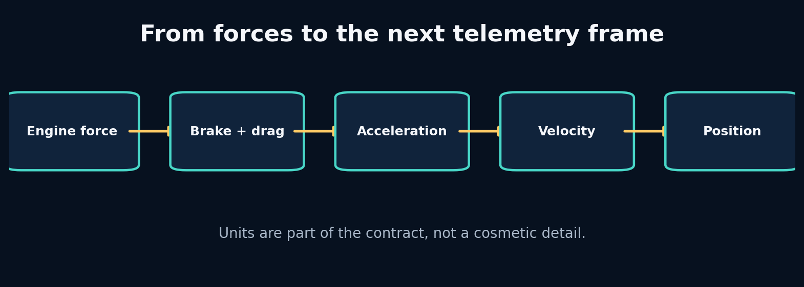

## What the picture is claiming

Build a physically interpretable transition, use dimensional analysis to catch errors, and understand the limits of toy physics.

Dimensional analysis asks whether the units on both sides of an equation agree. It is one of the cheapest and strongest debugging tools in simulation engineering. If force is in newtons and mass is in kilograms, acceleration is metres per second squared. If speed enters a squared term, a unit conversion error is squared too.

A toy longitudinal model combines engine force, braking force and drag. It will not reproduce downforce, tyre load sensitivity, energy recovery, differential behaviour or setup effects. That is fine when the model's purpose is to generate causal examples and test software contracts. It is dangerous if the UI presents the result as lap-time truth.

The hand-written model also teaches residual learning: instead of asking a neural network to rediscover every obvious relationship, we can predict the correction to a known physics approximation. Whether that helps is an empirical decision.

## Label every block

- **Dimensional analysis:** Check that quantities combined by an equation have compatible units. In APEX: Catches km/h–m/s and timestamp errors before training.
- **Force balance:** Net force is the sum of propulsive and resisting forces. In APEX: Provides an interpretable synthetic transition.
- **Residual model:** A learned correction added to a known baseline model. In APEX: Possible hybrid physics/ML architecture.
- **Numerical stability:** Whether repeated computation remains bounded and sensible. In APEX: Critical for long autoregressive rollouts and SSM state.

## Walk one value through it

Suppose the drag acceleration term is \(c v^2\). Converting from m/s to km/h multiplies speed by 3.6. Squaring multiplies the drag term by \(3.6^2=12.96\). The model therefore applies nearly thirteen times too much drag.

For a 50 m/s car with mass 800 kg:

- Engine force: 8,000 N
- Brake force: 0 N
- Drag: 2,500 N
- Net force: 5,500 N
- Acceleration: `5500 / 800 = 6.875 m/s²`
- At `dt=0.1`, velocity increases by `0.6875 m/s`

If speed were incorrectly treated as 180 in a coefficient calibrated for 50, the quadratic term would dominate and could create impossible negative velocity.

Now repeat the trace using one value from the packaged lab. Write its shape and unit before and after every transformation. If a block contains a learned model, distinguish its parameters from its temporary activation/state.

## What crosses each arrow?

Use this checklist:

- persistent state or temporary activation;
- observation, action, context, target or identifier;
- raw or normalized units;
- deterministic value or distribution parameters/sample;
- training-time evidence or deployment-time evidence;
- in-memory tensor or durable artifact reference.

## Break one arrow

Feed speed in km/h without conversion. Then set mass to zero or throttle above one. Observe which failures become exceptions and which silently produce nonsense.

The first visible symptom may occur several blocks later. The debugging objective is to identify the earliest arrow whose actual contract differs from the diagram.

## Choosing a different route

- **Pure hand-written physics:** choose when you need interpretability, counterfactual control and known equations. Avoid when unknown tyre/track interactions dominate error.
- **Pure learned dynamics:** choose when you have broad representative data and care about predictive fit. Avoid when safety or extrapolation requires hard physical guarantees.
- **Residual learning:** choose when a baseline captures broad physics and data can learn systematic corrections. Avoid when the baseline is badly misspecified and constrains learning in the wrong direction.

## APEX implementation map

```text
projects/03_lap_physics/main.py
apex_engine/src/apexsim/data/synthetic.py
apex_engine/src/apexsim/evaluation.py
```

Open those files and redraw the diagram with exact function names and tensor shapes. Then add one missing production block—validation, logging, registry, monitoring or UI provenance—that the conceptual diagram intentionally omits.

## Explain it without vocabulary

Explain the plate to a five-year-old using objects moving through boxes. Then explain it to an engineer using contracts, shapes, units and failure modes. If both explanations are accurate, the idea is becoming durable.


# Plate 4: 4. Sampling, Aliasing and Time Alignment

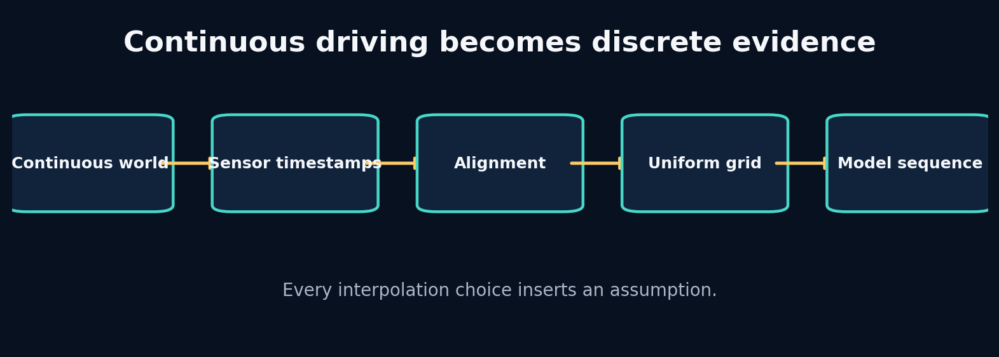

## What the picture is claiming

Turn asynchronous telemetry into a defensible time grid without creating fake evidence or future leakage.

Sampling converts a continuous process into discrete observations. If the sample rate is too low for the dynamics, high-frequency behaviour aliases into a different pattern. No architecture can reconstruct information that the sensor never captured without additional assumptions.

Alignment chooses which measurements describe the same model time. A backward as-of join says: at each car timestamp, use the latest context that was already available. A nearest join may use the future. A tolerance limits how stale a matched measurement may be. These are causal policies, not dataframe trivia.

Resampling onto a uniform grid simplifies windows and batch training, but interpolation must respect feature type. Continuous speed may be linearly interpolated across short gaps. Gear and flags are categorical and generally require forward fill or explicit unknown values. Long gaps should be marked invalid, not painted over.

## Label every block

- **Sampling rate:** How many observations are recorded per second. In APEX: Defines temporal resolution and sequence length.
- **Aliasing:** A high-frequency process appears as a different lower-frequency pattern. In APEX: Can hide braking spikes or steering oscillations.
- **As-of join:** Match each timestamp with a nearby record under a direction and tolerance policy. In APEX: Aligns weather, position and telemetry streams.
- **Staleness:** How old a context value is when reused. In APEX: A monitoring feature and validation rule.

## Walk one value through it

The Nyquist guideline says a sinusoid of frequency \(f\) requires sampling above \(2f\) to avoid ambiguity. An 8 Hz oscillation needs more than 16 Hz. At 5 Hz, sample times are 0, 0.2, 0.4… seconds. The phase advances `8 × 0.2 = 1.6` cycles per sample, equivalent to an apparent 0.6-cycle advance after wrapping. The observed pattern therefore resembles a 3 Hz oscillation (`0.6 × 5`).

For alignment, suppose car timestamps are 0.0, 0.2, 0.4, 0.6 and rain observations are 0.05 and 0.55. A backward join at 0.4 uses rain from 0.05; a nearest join uses 0.55, leaking a future value by 0.15 seconds.

Now repeat the trace using one value from the packaged lab. Write its shape and unit before and after every transformation. If a block contains a learned model, distinguish its parameters from its temporary activation/state.

## What crosses each arrow?

Use this checklist:

- persistent state or temporary activation;
- observation, action, context, target or identifier;
- raw or normalized units;
- deterministic value or distribution parameters/sample;
- training-time evidence or deployment-time evidence;
- in-memory tensor or durable artifact reference.

## Break one arrow

Change `direction` to `nearest` and remove the tolerance. Add a future rain spike at 0.41. Observe how an earlier car frame receives information from the future.

The first visible symptom may occur several blocks later. The debugging objective is to identify the earliest arrow whose actual contract differs from the diagram.

## Choosing a different route

- **Backward as-of:** choose when features must reflect information available online. Avoid when the quantity is defined as a symmetric offline estimate.
- **Nearest join:** choose when both streams are synchronized measurements and future use is scientifically acceptable. Avoid when forecasting, control or causal analysis.
- **Linear interpolation:** choose when a continuous signal has short, well-sampled gaps. Avoid when categorical states, discontinuities or long outages.

## APEX implementation map

```text
labs/04_sampling_aliasing/solution.py
labs/19_time_alignment/solution.py
apex_engine/src/apexsim/data/fastf1_adapter.py
apex_engine/src/apexsim/data/openf1_adapter.py
```

Open those files and redraw the diagram with exact function names and tensor shapes. Then add one missing production block—validation, logging, registry, monitoring or UI provenance—that the conceptual diagram intentionally omits.

## Explain it without vocabulary

Explain the plate to a five-year-old using objects moving through boxes. Then explain it to an engineer using contracts, shapes, units and failure modes. If both explanations are accurate, the idea is becoming durable.


# Plate 5: 5. Canonical Contracts and Quality Gates

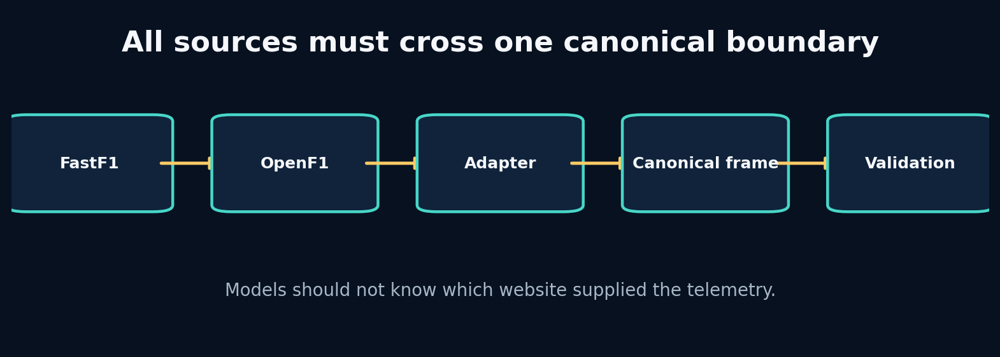

## What the picture is claiming

Build one source-independent telemetry contract and make invalid evidence fail before it reaches a model.

A canonical contract is not merely a dataframe schema. It specifies names, types, units, legal ranges, timing semantics, missingness, identifiers and invariants. Source adapters are translators: they may parse and convert, but they should not secretly perform model-specific feature engineering.

A quality gate separates admissible evidence from rejected or quarantined evidence. Some checks are hard errors—missing timestamp, impossible unit, duplicate key. Others are warnings—unusual prevalence or a short gap. The distinction should reflect whether downstream interpretation remains valid.

Contracts also enable replaceability. You can test the entire pipeline with synthetic data, then swap to FastF1 without changing the window builder or model. This is the central architectural move that lets APEX start before F1 25 is available.

## Label every block

- **Canonical contract:** One stable internal representation accepted by all downstream components. In APEX: The source-independent telemetry frame.
- **Adapter:** A boundary component translating one external source into the canonical representation. In APEX: FastF1, OpenF1 and future UDP adapters.
- **Quality gate:** Executable rules deciding whether evidence may proceed. In APEX: Range, timing, duplicate, finite-value and schema checks.
- **Quarantine:** Preserve questionable data separately instead of silently dropping or using it. In APEX: Allows investigation and reprocessing after a fix.

## Walk one value through it

Suppose the canonical speed unit is m/s and the legal range is 0–105 m/s. A source row says 320 km/h.

1. Adapter recognizes source unit km/h.
2. Convert: `320 / 3.6 = 88.89 m/s`.
3. Validate finite: yes.
4. Validate range: yes.
5. Store canonical value with source provenance.

If conversion were delayed until model code, validation would see 320 and reject a valid record—or the range would be widened and allow truly impossible m/s values. Therefore conversion belongs at the adapter boundary.

Now repeat the trace using one value from the packaged lab. Write its shape and unit before and after every transformation. If a block contains a learned model, distinguish its parameters from its temporary activation/state.

## What crosses each arrow?

Use this checklist:

- persistent state or temporary activation;
- observation, action, context, target or identifier;
- raw or normalized units;
- deterministic value or distribution parameters/sample;
- training-time evidence or deployment-time evidence;
- in-memory tensor or durable artifact reference.

## Break one arrow

Rename one source column, duplicate a timestamp, insert infinite speed, and swap throttle/brake. Notice that only some defects are detectable from shape and range.

The first visible symptom may occur several blocks later. The debugging objective is to identify the earliest arrow whose actual contract differs from the diagram.

## Choosing a different route

- **Loose dataframe convention:** choose when exploratory one-off analysis. Avoid when multiple sources, teams or production reuse.
- **Pydantic/dataclass contract:** choose when you need typed configuration and row/batch metadata validation. Avoid when per-element validation becomes a throughput bottleneck; validate batches at boundaries.
- **Schema registry:** choose when many producers and consumers evolve independently. Avoid when a small local project where the operational overhead exceeds value.

## APEX implementation map

```text
apex_engine/src/apexsim/contracts.py
apex_engine/src/apexsim/data/validate.py
apex_engine/src/apexsim/data/fastf1_adapter.py
apex_engine/src/apexsim/data/openf1_adapter.py
```

Open those files and redraw the diagram with exact function names and tensor shapes. Then add one missing production block—validation, logging, registry, monitoring or UI provenance—that the conceptual diagram intentionally omits.

## Explain it without vocabulary

Explain the plate to a five-year-old using objects moving through boxes. Then explain it to an engineer using contracts, shapes, units and failure modes. If both explanations are accurate, the idea is becoming durable.


# Plate 6: 6. FastF1 and OpenF1: Ingest Real Evidence Without Polluting the Core


## What the picture is claiming

Understand the complete data path from a public F1 source to canonical telemetry and learn to keep network concerns outside model code.

Network retrieval, caching, parsing, source-specific naming and canonical conversion are separate steps. Keeping them separate lets you replay raw responses when an adapter changes, test conversion without the network, and avoid rate-limit failures inside training.

The safest ingestion process lands raw evidence first. A second deterministic step creates canonical data. This gives you two forensic layers: “what did the source return?” and “how did our code interpret it?” A model run should point to both.

FastF1 and OpenF1 can overlap without being interchangeable. Differences in sampling, provenance and field definitions should be measured rather than assumed away. APEX treats each adapter as an independently tested producer of the canonical contract.

## Label every block

- **Landing zone:** Immutable storage of source-native responses before interpretation. In APEX: Cached session/API data used for reproducible adapter tests.
- **Provenance:** Information describing where, when and how a record was obtained. In APEX: Source, event/session identifiers, driver, retrieval time and adapter version.
- **Idempotent ingestion:** Repeating the same request does not create conflicting outputs. In APEX: Deterministic paths and hashes for source snapshots.
- **Rate limit / cache:** External service constraints and local reuse strategy. In APEX: Prevents training from repeatedly hitting public services.

## Walk one value through it

Suppose OpenF1 returns UTC timestamps `12:00:00.100`, `12:00:00.300`, and FastF1 returns session-relative seconds `5.2`, `5.4`. To combine them, you need a session start reference or a shared event clock. If session start is `11:59:54.900`, the UTC records map to `5.2` and `5.4` seconds.

The adapter should preserve:

1. Source timestamp exactly as received.
2. Parsed canonical timestamp.
3. Session and driver identifiers.
4. Source field names/units or adapter version.
5. Missingness and interpolation flags.

Without those fields, an apparent 0.2-second alignment error cannot be traced.

Now repeat the trace using one value from the packaged lab. Write its shape and unit before and after every transformation. If a block contains a learned model, distinguish its parameters from its temporary activation/state.

## What crosses each arrow?

Use this checklist:

- persistent state or temporary activation;
- observation, action, context, target or identifier;
- raw or normalized units;
- deterministic value or distribution parameters/sample;
- training-time evidence or deployment-time evidence;
- in-memory tensor or durable artifact reference.

## Break one arrow

Mock a source response where one field changes name, one timestamp is timezone-naive, and one speed column changes unit. Run the adapter tests and identify which change is detected.

The first visible symptom may occur several blocks later. The debugging objective is to identify the earliest arrow whose actual contract differs from the diagram.

## Choosing a different route

- **FastF1:** choose when python-centric historical session analysis with convenient session abstractions and cached telemetry. Avoid when you require an http-only integration or fields outside its supported representation.
- **OpenF1:** choose when service-style access to historical/live endpoint data and independent stream retrieval. Avoid when you assume every endpoint is synchronized or identical to fastf1.
- **Both as separate datasets:** choose when you want cross-source validation or broader coverage. Avoid when you have not measured semantic and temporal differences.

## APEX implementation map

```text
apex_engine/src/apexsim/data/fastf1_adapter.py
apex_engine/src/apexsim/data/openf1_adapter.py
apex_engine/src/apexsim/cli.py
apex_engine/README.md
```

Open those files and redraw the diagram with exact function names and tensor shapes. Then add one missing production block—validation, logging, registry, monitoring or UI provenance—that the conceptual diagram intentionally omits.

## Explain it without vocabulary

Explain the plate to a five-year-old using objects moving through boxes. Then explain it to an engineer using contracts, shapes, units and failure modes. If both explanations are accurate, the idea is becoming durable.


# Plate 7: 7. Windows, Session Splits and Normalization Without Leakage

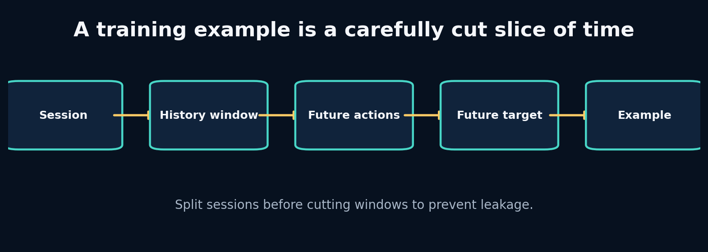

## What the picture is claiming

Turn canonical sessions into causal training examples while keeping validation and test evidence genuinely independent.

A sequence example has three distinct pieces: history observations, future interventions/context, and future target state. The model must not receive the future target inside its inputs. This sounds obvious, but dataframe slicing and feature lists can quietly duplicate it.

Split units should match the deployment claim. If the engine will simulate a new race session, split by session or event before making windows. A time-based holdout within one session answers a narrower question. Random windows almost always overstate performance when overlap is high.

Normalization must be fitted only on training data. Validation and test are transformed using stored training statistics. Otherwise the mean and variance leak information about future or held-out distributions, and deployment cannot reproduce the transform.

## Label every block

- **History length:** How many past frames are visible before a forecast begins. In APEX: Controls memory evidence and input cost.
- **Forecast horizon:** How many future transitions are predicted. In APEX: Defines simulation duration and error accumulation.
- **Split unit:** The independent entity assigned wholly to train, validation or test. In APEX: Usually session/event, not overlapping windows.
- **Train-only normalizer:** Scaling statistics fitted exclusively on training observations. In APEX: Persisted with the model artifact.

## Walk one value through it

For length `N=100`, history `H=20`, future `F=5`, stride 1, the first window consumes frames 0–24 and the last begins at 75, so the count is

\[N-H-F+1=100-20-5+1=76.\]

Window 1 uses frames 0–24; window 2 uses 1–25. They share 24 of 25 frames. Assigning them to different splits creates almost complete leakage.

For normalization, training speeds `[40, 50, 60]` have mean 50 and standard deviation about 8.165. A test speed 70 becomes `(70−50)/8.165 ≈ 2.45`. Recomputing the mean with test data would shrink that value and leak the test distribution.

Now repeat the trace using one value from the packaged lab. Write its shape and unit before and after every transformation. If a block contains a learned model, distinguish its parameters from its temporary activation/state.

## What crosses each arrow?

Use this checklist:

- persistent state or temporary activation;
- observation, action, context, target or identifier;
- raw or normalized units;
- deterministic value or distribution parameters/sample;
- training-time evidence or deployment-time evidence;
- in-memory tensor or durable artifact reference.

## Break one arrow

Create all windows first and randomly split them. Train a nearest-neighbour or linear baseline. Compare its test score with a session-level split.

The first visible symptom may occur several blocks later. The debugging objective is to identify the earliest arrow whose actual contract differs from the diagram.

## Choosing a different route

- **Random window split:** choose when only for debugging shape/training code, never for a generalization claim with overlap. Avoid when any realistic telemetry evaluation.
- **Session split:** choose when deployment targets unseen sessions under similar tracks/drivers. Avoid when you specifically study later portions of the same session.
- **Event/track split:** choose when you need evidence of transfer to new circuits or events. Avoid when the dataset is too small to support that claim.

## APEX implementation map

```text
apex_engine/src/apexsim/data/windows.py
apex_engine/src/apexsim/pipeline/stages.py
apex_engine/tests/test_windows.py
debugging_cases/04_random_window_split
debugging_cases/06_normalizer_leak
```

Open those files and redraw the diagram with exact function names and tensor shapes. Then add one missing production block—validation, logging, registry, monitoring or UI provenance—that the conceptual diagram intentionally omits.

## Explain it without vocabulary

Explain the plate to a five-year-old using objects moving through boxes. Then explain it to an engineer using contracts, shapes, units and failure modes. If both explanations are accurate, the idea is becoming durable.


# Plate 8: 8. Statistics, Baselines and Uncertainty as Engineering Controls

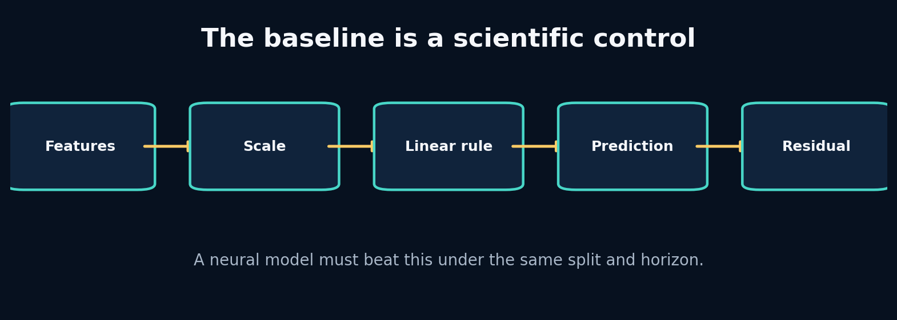

## What the picture is claiming

Use simple models and residual analysis to determine what the data contains before escalating to deep sequence architectures.

Start with the distribution: means, spreads, missingness, correlations and conditional relationships. Then create baselines that correspond to real hypotheses. Persistence says the world changes slowly. Linear regression says the change is approximately additive in observed features. A physics baseline says known equations explain most of the transition.

Residuals—target minus prediction—show what the baseline failed to explain. Plot residuals against speed, curvature, rain, tyre age and horizon. Structured residuals are a blueprint for the next model. Random-looking residuals near measurement noise may mean a larger model has little room to help.

Uncertainty has several meanings. Aleatoric uncertainty reflects inherently variable outcomes or noisy measurements. Epistemic uncertainty reflects lack of knowledge, often rising outside the training distribution. A point predictor does not automatically communicate either.

## Label every block

- **Persistence baseline:** Predict that the next state equals the current state. In APEX: Strong short-horizon speed control.
- **Residual:** Observed target minus model prediction. In APEX: Reveals missing nonlinearities, context or delay.
- **Calibration:** Predicted uncertainty/probability matches empirical frequency or error. In APEX: Needed before presenting confidence in imagined futures.
- **Distribution shift:** Deployment evidence differs from training evidence. In APEX: New tracks, weather, drivers or game telemetry.

## Walk one value through it

Suppose true next speeds are `[50.2, 60.1, 69.7]` and persistence predicts `[50.0, 60.0, 70.0]`.

Absolute errors are `[0.2, 0.1, 0.3]`; MAE is `(0.2+0.1+0.3)/3 = 0.2 m/s`.

A neural model with MAE 0.18 improves by 0.02 m/s, or 10% relative. That gain might matter—or it might vanish on a new session, cost far more compute, and introduce physical violations. Compare by horizon, subgroup, latency and stability before declaring victory.

If residuals under braking average +0.8 m/s (targets are higher than predictions), the baseline is overestimating deceleration. That points to brake scaling, delay or grip context.

Now repeat the trace using one value from the packaged lab. Write its shape and unit before and after every transformation. If a block contains a learned model, distinguish its parameters from its temporary activation/state.

## What crosses each arrow?

Use this checklist:

- persistent state or temporary activation;
- observation, action, context, target or identifier;
- raw or normalized units;
- deterministic value or distribution parameters/sample;
- training-time evidence or deployment-time evidence;
- in-memory tensor or durable artifact reference.

## Break one arrow

Add the target next speed as an input feature and watch MAE collapse. Then randomize brake while preserving speed. Compare coefficient signs and residuals.

The first visible symptom may occur several blocks later. The debugging objective is to identify the earliest arrow whose actual contract differs from the diagram.

## Choosing a different route

- **Persistence:** choose when very short horizons and slowly changing states. Avoid when actions or geometry cause rapid transitions.
- **Linear / Ridge:** choose when you need interpretability, speed and a strong control. Avoid when residuals show substantial nonlinear or temporal structure.
- **Gradient-boosted trees:** choose when tabular nonlinearities dominate and fixed windows can summarize history. Avoid when you need smooth autoregressive latent dynamics or differentiable planning.

## APEX implementation map

```text
apex_engine/src/apexsim/models/baselines.py
apex_engine/src/apexsim/evaluation.py
apex_engine/src/apexsim/pipeline/stages.py
debugging_cases/03_target_leakage
```

Open those files and redraw the diagram with exact function names and tensor shapes. Then add one missing production block—validation, logging, registry, monitoring or UI provenance—that the conceptual diagram intentionally omits.

## Explain it without vocabulary

Explain the plate to a five-year-old using objects moving through boxes. Then explain it to an engineer using contracts, shapes, units and failure modes. If both explanations are accurate, the idea is becoming durable.


# Plate 9: 9. Tensors, Autograd and the Training Loop You Can Explain

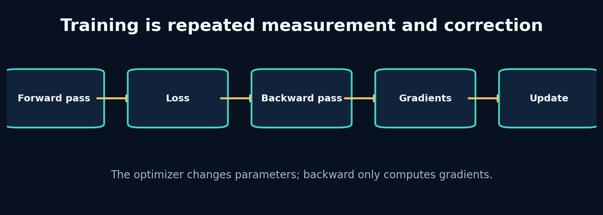

## What the picture is claiming

Build a PyTorch training loop while understanding every tensor, gradient and parameter update rather than memorizing boilerplate.

A tensor is an array plus shape, dtype, device and—when requested—a connection to a computation graph. The forward pass applies parameterized operations. The loss reduces prediction error to a scalar. Backpropagation computes derivatives of that scalar with respect to leaf parameters and stores them in `.grad`. The optimizer then uses those gradients to update parameters.

Gradients accumulate by default. That enables deliberate gradient accumulation but causes a bug when forgotten. Evaluation must switch behaviour-sensitive layers with `model.eval()` and disable graph construction with `torch.no_grad()`.

The most effective way to learn this is to print parameter values, gradients and loss before and after each line on a tiny problem whose correct mapping is known.

## Label every block

- **Computation graph:** The recorded chain of operations connecting inputs, parameters and loss. In APEX: Enables gradient-based training of all world models.
- **Gradient:** Local sensitivity of loss to a parameter. In APEX: Stored in each trainable parameter after backward.
- **Optimizer state:** Extra memory used to turn gradients into updates. In APEX: Adam moments are checkpointed with the model during resumable training.
- **Train/eval mode:** Switch for layers such as dropout and batch normalization. In APEX: Ensures deterministic, correctly normalized validation and rollout.

## Walk one value through it

For a one-parameter model \(\hat y=wx\) with `x=2`, `y=6`, `w=1`, and squared loss \((\hat y-y)^2`:

1. Prediction: `1 × 2 = 2`.
2. Error: `2 − 6 = −4`.
3. Loss: `16`.
4. Gradient: `dL/dw = 2(wx−y)x = 2(−4)(2) = −16`.
5. With learning rate 0.1, SGD update: `w ← 1 − 0.1(−16) = 2.6`.
6. New prediction: `5.2`; new loss: `0.64`.

Backward computes −16; the optimizer performs the update to 2.6.

Now repeat the trace using one value from the packaged lab. Write its shape and unit before and after every transformation. If a block contains a learned model, distinguish its parameters from its temporary activation/state.

## What crosses each arrow?

Use this checklist:

- persistent state or temporary activation;
- observation, action, context, target or identifier;
- raw or normalized units;
- deterministic value or distribution parameters/sample;
- training-time evidence or deployment-time evidence;
- in-memory tensor or durable artifact reference.

## Break one arrow

Remove `zero_grad`, increase learning rate by 100×, and accidentally shape targets as `[B]` while predictions are `[B,1]`. Observe accumulation, divergence and broadcasting.

The first visible symptom may occur several blocks later. The debugging objective is to identify the earliest arrow whose actual contract differs from the diagram.

## Choosing a different route

- **SGD:** choose when you want transparent updates and can tune schedules carefully. Avoid when sparse/noisy gradients need faster adaptive progress.
- **Adam/AdamW:** choose when a strong default for deep sequence models and fast iteration. Avoid when you assume it removes the need for learning-rate and regularization experiments.
- **Gradient clipping:** choose when recurrent or long-horizon training shows occasional exploding norms. Avoid when it hides systematically bad scaling or unstable architecture.

## APEX implementation map

```text
apex_engine/src/apexsim/training.py
apex_engine/src/apexsim/models/gru_world_model.py
debugging_cases/08_missing_eval_mode
debugging_cases/09_gradient_accumulation
```

Open those files and redraw the diagram with exact function names and tensor shapes. Then add one missing production block—validation, logging, registry, monitoring or UI provenance—that the conceptual diagram intentionally omits.

## Explain it without vocabulary

Explain the plate to a five-year-old using objects moving through boxes. Then explain it to an engineer using contracts, shapes, units and failure modes. If both explanations are accurate, the idea is becoming durable.


# Plate 10: 10. Transition Models and Why Rollouts Fail

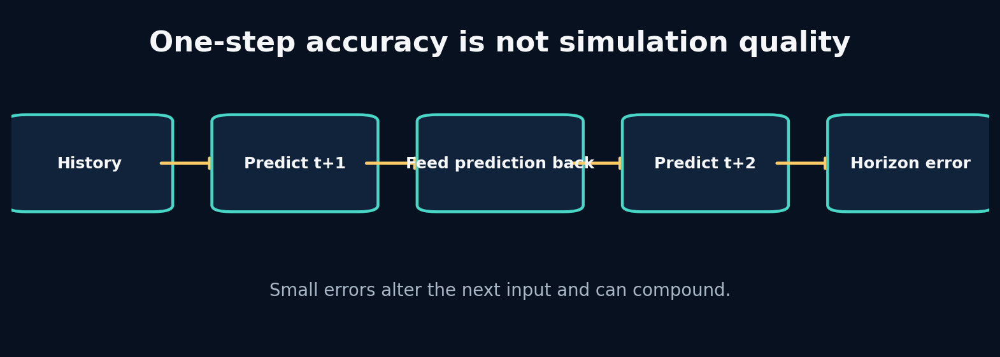

## What the picture is claiming

Build a one-step neural transition, convert it into an autoregressive simulator, and measure error compounding honestly.

One-step supervised training samples inputs from real data. Autoregressive inference samples later inputs from the model. This train–inference distribution shift is exposure bias. Even unbiased local noise can alter future controls' effects because the state enters nonlinear dynamics.

A rollout function must specify which future variables are known and which are predicted. In APEX, future controls/context can be provided by a scenario, while future state is generated. After each step, predicted state replaces the state portion of the next input; controls remain externally supplied.

Evaluation should report error by horizon rather than averaging all future steps. The shape of the curve distinguishes immediate bias, unstable compounding and long-memory failure.

## Label every block

- **Teacher forcing:** Train each transition using the true previous state. In APEX: Stable supervised training for GRU/RSSM components.
- **Autoregressive rollout:** Feed predicted state back to generate later states. In APEX: The actual simulation mode.
- **Exposure bias:** The model trains on true states but runs on its own imperfect states. In APEX: A central source of horizon degradation.
- **Horizon curve:** Error reported separately at each future step. In APEX: Primary evidence for useful simulation duration.

## Walk one value through it

With additive bias `e_{t+1}=e_t+0.1`, starting at zero, error after 20 steps is 2.0 m/s.

With amplification `e_{t+1}=1.05e_t+0.1`,

\[e_{20}=0.1\frac{1.05^{20}-1}{1.05-1}\approx3.31\text{ m/s}.\]

The one-step bias is still only 0.1, but the system dynamics amplify it. This is why one-step MAE cannot certify a simulator.

Now repeat the trace using one value from the packaged lab. Write its shape and unit before and after every transformation. If a block contains a learned model, distinguish its parameters from its temporary activation/state.

## What crosses each arrow?

Use this checklist:

- persistent state or temporary activation;
- observation, action, context, target or identifier;
- raw or normalized units;
- deterministic value or distribution parameters/sample;
- training-time evidence or deployment-time evidence;
- in-memory tensor or durable artifact reference.

## Break one arrow

During rollout, accidentally keep feeding the last real state instead of each prediction. The multi-step score may look surprisingly strong because you are not actually simulating.

The first visible symptom may occur several blocks later. The debugging objective is to identify the earliest arrow whose actual contract differs from the diagram.

## Choosing a different route

- **One-step training:** choose when a stable starting point with abundant transition examples. Avoid when you treat its metric as rollout certification.
- **Multi-step loss:** choose when long-horizon accuracy matters and compute allows unrolled training. Avoid when early training is unstable or the horizon curriculum is not controlled.
- **Scheduled sampling:** choose when you want gradual exposure to model-generated states. Avoid when you assume it guarantees consistent probabilistic learning.

## APEX implementation map

```text
projects/04_mlp_transition/main.py
apex_engine/src/apexsim/simulation.py
apex_engine/src/apexsim/evaluation.py
apex_engine/src/apexsim/models/gru_world_model.py
```

Open those files and redraw the diagram with exact function names and tensor shapes. Then add one missing production block—validation, logging, registry, monitoring or UI provenance—that the conceptual diagram intentionally omits.

## Explain it without vocabulary

Explain the plate to a five-year-old using objects moving through boxes. Then explain it to an engineer using contracts, shapes, units and failure modes. If both explanations are accurate, the idea is becoming durable.


# Plate 11: 11. Recurrent Memory and the GRU From the Inside

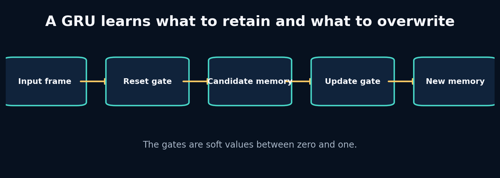

## What the picture is claiming

Earn recurrent memory by exposing the limits of fixed-frame transitions, then inspect how GRU gates update hidden state.

A recurrent neural network updates hidden memory as each frame arrives. The final hidden state is not a literal copy of history; it is a learned summary optimized for the training objective. A vanilla recurrent cell can struggle when useful information must survive many updates because gradients repeatedly pass through the same transition.

A GRU adds gates. The update gate decides how much old memory to keep versus replace. The reset gate controls how much previous memory influences the candidate update. These are soft, feature-wise decisions, not binary switches. The same hidden dimension can retain long-term tyre information while rapidly updating braking state.

Using `nn.GRU` does not guarantee meaningful memory. You still need enough history, correct ordering, no hidden-state leakage across independent sequences, and evaluation that tests whether memory improves the target horizon.

## Label every block

- **Hidden state:** A learned vector carried across sequence steps. In APEX: Compressed recent driving and unobserved dynamical context.
- **Update gate:** Controls interpolation between old memory and candidate memory. In APEX: Lets some information persist while other information changes.
- **Reset gate:** Controls how previous memory contributes to the candidate update. In APEX: Allows rapid forgetting when current evidence changes regime.
- **Sequence boundary:** The point where hidden memory must be reset or intentionally transferred. In APEX: Driver/session windows cannot share hidden state accidentally.

## Walk one value through it

A simplified update is

\[h_t=(1-z_t)h_{t-1}+z_t\tilde h_t.\]

If old memory is `h=0.8`, candidate memory is `−0.2`:

- With update gate `z=0.1`: `h_t=0.9(0.8)+0.1(−0.2)=0.70`. Most old memory survives.
- With `z=0.9`: `h_t=0.1(0.8)+0.9(−0.2)=−0.10`. The new evidence largely overwrites memory.

This interpolation makes a gate interpretable at the mechanism level, although individual learned dimensions may not map cleanly to human concepts.

Now repeat the trace using one value from the packaged lab. Write its shape and unit before and after every transformation. If a block contains a learned model, distinguish its parameters from its temporary activation/state.

## What crosses each arrow?

Use this checklist:

- persistent state or temporary activation;
- observation, action, context, target or identifier;
- raw or normalized units;
- deterministic value or distribution parameters/sample;
- training-time evidence or deployment-time evidence;
- in-memory tensor or durable artifact reference.

## Break one arrow

Reuse the hidden state from one session as the initial state for an unrelated session. Also shuffle time within each sequence while preserving rows.

The first visible symptom may occur several blocks later. The debugging objective is to identify the earliest arrow whose actual contract differs from the diagram.

## Choosing a different route

- **Vanilla RNN:** choose when tiny educational tasks and very short dependencies. Avoid when long/noisy telemetry histories.
- **GRU:** choose when strong compact recurrent baseline with fewer parameters than lstm. Avoid when you have evidence that longer structured memory or parallel training is required.
- **LSTM:** choose when you value an explicit cell state and gates and have sufficient compute/data. Avoid when extra complexity provides no measured gain.

## APEX implementation map

```text
labs/11_rnn_from_scratch/solution.py
labs/12_gru_gates/solution.py
projects/06_gru_forecaster/main.py
apex_engine/src/apexsim/models/gru_world_model.py
debugging_cases/07_hidden_state_reuse
```

Open those files and redraw the diagram with exact function names and tensor shapes. Then add one missing production block—validation, logging, registry, monitoring or UI provenance—that the conceptual diagram intentionally omits.

## Explain it without vocabulary

Explain the plate to a five-year-old using objects moving through boxes. Then explain it to an engineer using contracts, shapes, units and failure modes. If both explanations are accurate, the idea is becoming durable.


# Plate 12: 12. Classical State-Space Models: Dynamics as Memory

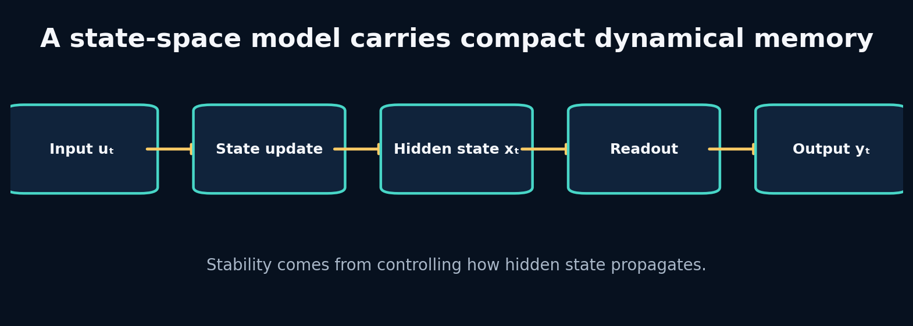

## What the picture is claiming

Understand state-space recurrence mathematically, inspect stability, and connect classical dynamical systems to modern sequence models.

A discrete linear state-space model is

\[x_t=Ax_{t-1}+Bu_t,\qquad y_t=Cx_t+Du_t.\]

The hidden state `x` is memory; `A` controls how it persists and mixes; `B` writes input; `C` reads output. Repeated powers of `A` determine whether past information decays, persists, oscillates or explodes.

Many modern SSMs begin from continuous-time dynamics and discretize them for sampled sequences. This connects model behaviour to the time step. A change from 5 Hz to 20 Hz should not be treated as an arbitrary tensor resize when the transition is supposed to represent time.

Linear recurrence alone cannot model all nonlinear racing dynamics, but it exposes memory timescales and stability more directly than a generic black box.

## Label every block

- **State matrix A:** Controls hidden-state propagation between steps. In APEX: Determines memory decay, coupling and stability.
- **Input matrix B:** Controls how current telemetry writes into memory. In APEX: Maps actions/context into dynamical state.
- **Readout C:** Maps hidden memory to predicted output. In APEX: Produces next-state features from SSM memory.
- **Spectral radius:** Largest absolute eigenvalue of A; a key discrete stability indicator. In APEX: Values above one can amplify state without bound.

## Walk one value through it

For `x_t = a x_{t-1}` after input stops:

- If `a=1.05`, then after 20 steps `x` is multiplied by `1.05²⁰ ≈ 2.65`.
- If `a=0.95`, it is multiplied by `0.95²⁰ ≈ 0.358`.
- If `a=1`, memory persists exactly.
- If `a=−0.95`, memory alternates sign while decaying.

For a matrix, eigenvalues play the role of these scalar factors along different modes. Stability does not guarantee usefulness: a transition that decays too quickly forgets everything.

Now repeat the trace using one value from the packaged lab. Write its shape and unit before and after every transformation. If a block contains a learned model, distinguish its parameters from its temporary activation/state.

## What crosses each arrow?

Use this checklist:

- persistent state or temporary activation;
- observation, action, context, target or identifier;
- raw or normalized units;
- deterministic value or distribution parameters/sample;
- training-time evidence or deployment-time evidence;
- in-memory tensor or durable artifact reference.

## Break one arrow

Change a diagonal value in `A` to 1.2 and roll for 100 zero-input steps. Then set both diagonal values to 0.1.

The first visible symptom may occur several blocks later. The debugging objective is to identify the earliest arrow whose actual contract differs from the diagram.

## Choosing a different route

- **Fixed linear SSM:** choose when system identification, interpretability and approximately linear dynamics. Avoid when strong context-dependent nonlinear transitions dominate.
- **Nonlinear readout:** choose when memory dynamics are simple but state-to-output mapping is nonlinear. Avoid when input must alter the memory law itself.
- **Input-dependent SSM:** choose when different telemetry regimes require selective writing/forgetting. Avoid when a fixed transition already works and simplicity matters.

## APEX implementation map

```text
labs/13_linear_ssm/solution.py
projects/07_selective_ssm/main.py
apex_engine/src/apexsim/models/ssm_world_model.py
debugging_cases/10_exploding_ssm
```

Open those files and redraw the diagram with exact function names and tensor shapes. Then add one missing production block—validation, logging, registry, monitoring or UI provenance—that the conceptual diagram intentionally omits.

## Explain it without vocabulary

Explain the plate to a five-year-old using objects moving through boxes. Then explain it to an engineer using contracts, shapes, units and failure modes. If both explanations are accurate, the idea is becoming durable.


# Plate 13: 13. Selective State-Space Models and What Mamba Changes

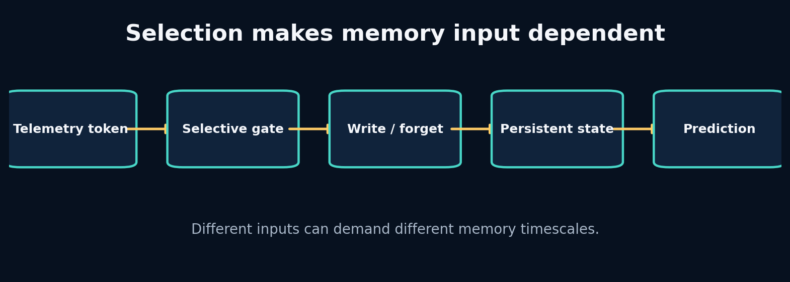

## What the picture is claiming

Build an input-dependent memory cell, understand selection, and separate the core Mamba idea from implementation hype.

Selection means model parameters or gates depend on the current input. Instead of one fixed `A` and `B`, the sequence determines how strongly memory persists and what content is written. This gives content-aware recurrence while preserving a state-space perspective.

Mamba combines selective state-space dynamics with hardware-aware computation so long sequences can be processed efficiently. The important conceptual move for this curriculum is not “replace everything with Mamba.” It is: **make memory propagation conditional on the token when fixed dynamics are insufficient.**

A small selective cell can be written as `h_t = a(x_t) ⊙ h_{t-1} + (1−a(x_t)) ⊙ b(x_t)`. It resembles a gated recurrent update. The difference between educational cell and research architecture must remain explicit.

## Label every block

- **Selection:** Current input changes how memory is written, retained or read. In APEX: Braking, weather or geometry can trigger different memory behaviour.
- **Input-dependent decay:** The retention factor is computed from the current token. In APEX: Adaptive timescales across race regimes.
- **Scan:** Efficiently apply a recurrence across sequence positions. In APEX: Important for long histories and GPU throughput.
- **Mamba block:** A complete architecture combining projections, selective SSM computation and implementation details. In APEX: A future challenger; not identical to the toy selective cell.

## Walk one value through it

Let old memory be `h=0.9`.

- Ordinary input produces retention `a=0.95` and candidate `b=0.2`: `h'=0.95(0.9)+0.05(0.2)=0.865`.
- Critical braking input produces retention `a=0.2` and candidate `b=−0.8`: `h'=0.2(0.9)+0.8(−0.8)=−0.46`.

The same memory dimension changes slowly during routine input and rapidly under a meaningful event. Selection is useful only if training learns gates that correspond to predictive needs rather than arbitrary noise.

Now repeat the trace using one value from the packaged lab. Write its shape and unit before and after every transformation. If a block contains a learned model, distinguish its parameters from its temporary activation/state.

## What crosses each arrow?

Use this checklist:

- persistent state or temporary activation;
- observation, action, context, target or identifier;
- raw or normalized units;
- deterministic value or distribution parameters/sample;
- training-time evidence or deployment-time evidence;
- in-memory tensor or durable artifact reference.

## Break one arrow

Remove the sigmoid/bound and allow retention greater than one. Then initialize decay so gates saturate near zero or one.

The first visible symptom may occur several blocks later. The debugging objective is to identify the earliest arrow whose actual contract differs from the diagram.

## Choosing a different route

- **Toy selective cell:** choose when learning the mechanism and testing whether input-dependent memory helps. Avoid when claiming mamba-equivalent speed or quality.
- **Official Mamba implementation:** choose when long sequences and benchmarks justify the dependency and hardware path. Avoid when your data are small, horizons short, or environment support is fragile.
- **GRU:** choose when a stable gated recurrent baseline is sufficient. Avoid when measured long-context/throughput limitations motivate another architecture.

## APEX implementation map

```text
labs/14_selective_ssm/solution.py
projects/07_selective_ssm/main.py
apex_engine/src/apexsim/models/ssm_world_model.py
apex_engine/configs/ssm_fast.yaml
```

Open those files and redraw the diagram with exact function names and tensor shapes. Then add one missing production block—validation, logging, registry, monitoring or UI provenance—that the conceptual diagram intentionally omits.

## Explain it without vocabulary

Explain the plate to a five-year-old using objects moving through boxes. Then explain it to an engineer using contracts, shapes, units and failure modes. If both explanations are accurate, the idea is becoming durable.


# Plate 14: 14. Autoencoders and Variational Latent State

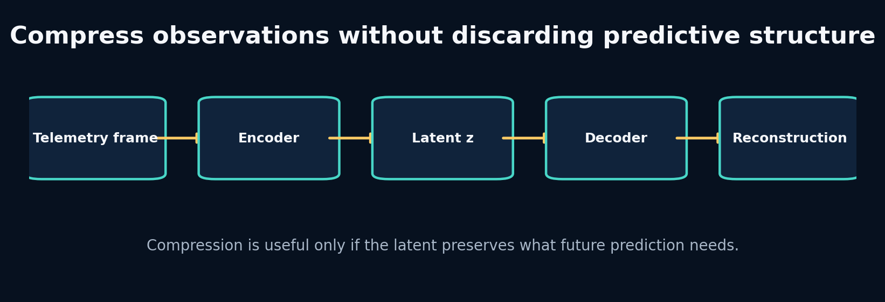

## What the picture is claiming

Learn representation compression by building it, then add probabilistic latent variables without confusing reconstruction with useful world modelling.

An autoencoder learns an encoder `z=f(x)` and decoder `x̂=g(z)` by minimizing reconstruction error. The bottleneck pressures the latent to preserve common information. Nothing requires each dimension to align with a human variable, and high-variance nuisance features may dominate.

A variational autoencoder predicts a distribution—usually mean and log variance—rather than one code. Sampling uses `z = μ + σ⊙ε`, which keeps the path differentiable with respect to `μ` and `σ`. A KL term regularizes the posterior toward a prior, enabling sampling but creating a tradeoff: too weak and the latent is irregular; too strong and it can ignore observations.

For world models, the latent should preserve information useful for dynamics and reward, not only instantaneous reconstruction. Temporal prediction losses or task probes test this.

## Label every block

- **Encoder:** Maps a high-dimensional observation into a compact representation. In APEX: Compresses telemetry/history into latent state.
- **Decoder:** Reconstructs or predicts observable state from latent representation. In APEX: Produces interpretable future telemetry.
- **Reparameterization:** Express stochastic sampling as differentiable transformation of parameter-free noise. In APEX: Allows RSSM/VAE posterior training.
- **KL divergence:** Penalty measuring difference between posterior and prior distributions. In APEX: Regularizes stochastic latent state and aligns imagination with inference.

## Walk one value through it

For one latent dimension with `μ=0.2`, `log variance=-1`:

1. Variance: `exp(-1)=0.3679`.
2. Standard deviation: `exp(-0.5)=0.6065`.
3. If sampled noise `ε=1.0`, then `z=0.2+0.6065=0.8065`.
4. KL to standard normal is `−0.5(1 + logvar − μ² − exp(logvar))`.
5. Substitute: `−0.5(1−1−0.04−0.3679)=0.20395`.

The KL is zero only when posterior mean is zero and variance is one. Driving every posterior to that point would erase observation information.

Now repeat the trace using one value from the packaged lab. Write its shape and unit before and after every transformation. If a block contains a learned model, distinguish its parameters from its temporary activation/state.

## What crosses each arrow?

Use this checklist:

- persistent state or temporary activation;
- observation, action, context, target or identifier;
- raw or normalized units;
- deterministic value or distribution parameters/sample;
- training-time evidence or deployment-time evidence;
- in-memory tensor or durable artifact reference.

## Break one arrow

Set KL weight extremely high and inspect whether reconstructions become generic. Then set it to zero and sample from the prior at inference.

The first visible symptom may occur several blocks later. The debugging objective is to identify the earliest arrow whose actual contract differs from the diagram.

## Choosing a different route

- **Deterministic autoencoder:** choose when compression and reconstruction matter; uncertainty is not required. Avoid when you need coherent sampling or probabilistic belief.
- **VAE:** choose when a smooth sampleable latent distribution is useful. Avoid when kl tradeoffs add complexity without serving the downstream task.
- **Predictive encoder:** choose when future-relevant structure matters more than reconstructing every input detail. Avoid when you still require high-fidelity observation generation.

## APEX implementation map

```text
labs/15_autoencoder/solution.py
labs/16_vae_reparameterization/solution.py
apex_engine/src/apexsim/models/rssm.py
debugging_cases/11_kl_collapse
```

Open those files and redraw the diagram with exact function names and tensor shapes. Then add one missing production block—validation, logging, registry, monitoring or UI provenance—that the conceptual diagram intentionally omits.

## Explain it without vocabulary

Explain the plate to a five-year-old using objects moving through boxes. Then explain it to an engineer using contracts, shapes, units and failure modes. If both explanations are accurate, the idea is becoming durable.


# Plate 15: 15. RSSMs and Dreamer: Learning to Imagine Without Observations

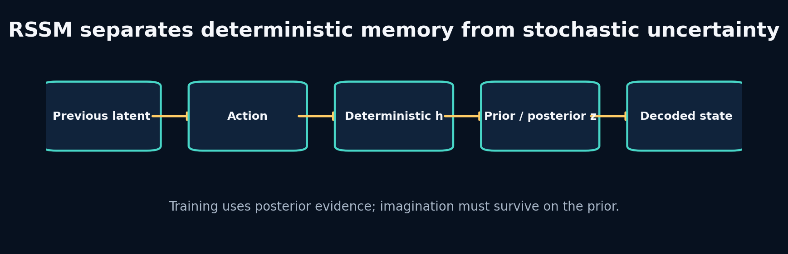

## What the picture is claiming

Implement the logic of a recurrent state-space model, distinguish posterior training from prior imagination, and understand Dreamer as a system rather than a buzzword.

An RSSM commonly has deterministic state `h_t` and stochastic state `z_t`. The transition updates `h_t` from previous latent/action. The prior predicts a distribution over `z_t` from `h_t`. During training, an encoder provides observation evidence and a posterior refines that distribution. The decoder predicts observation/state from `h_t,z_t`.

The KL term teaches the prior to resemble the posterior enough that prior-only imagination remains useful. Reconstruction or prediction terms teach the latent to represent evidence. These objectives can conflict. Posterior collapse, overconfident priors and compounding uncertainty are practical failures, not footnotes.

Dreamer adds reward/continuation models and learns actor/critic behaviour from trajectories imagined by the world model. Before trusting control, APEX must establish that interventions produce realistic, calibrated rollouts.

## Label every block

- **Deterministic state h:** Recurrent memory summarizing past latent/action sequence. In APEX: Carries stable temporal context.
- **Prior:** Latent distribution predicted without current observation. In APEX: Used during imagination and planning.
- **Posterior:** Latent distribution conditioned on current observation evidence. In APEX: Used during training/state inference.
- **Imagination:** Rollout using learned prior dynamics without future observations. In APEX: Generates counterfactual telemetry trajectories.

## Walk one value through it

Suppose posterior is `N(μ_q=1, σ_q=0.5)` and prior is `N(μ_p=0, σ_p=1)`. The one-dimensional Gaussian KL `KL(q||p)` is

\[\log(\sigma_p/\sigma_q)+\frac{\sigma_q^2+(\mu_q-\mu_p)^2}{2\sigma_p^2}-\frac12.\]

Substitute:

- `log(1/0.5)=0.693`
- numerator `0.25 + 1 = 1.25`
- divide by 2 gives `0.625`
- subtract 0.5
- total `0.818`

The gap signals that the prior cannot yet reproduce the posterior belief. Reducing it by making both distributions uninformative would also be bad; reconstruction/prediction must remain strong.

Now repeat the trace using one value from the packaged lab. Write its shape and unit before and after every transformation. If a block contains a learned model, distinguish its parameters from its temporary activation/state.

## What crosses each arrow?

Use this checklist:

- persistent state or temporary activation;
- observation, action, context, target or identifier;
- raw or normalized units;
- deterministic value or distribution parameters/sample;
- training-time evidence or deployment-time evidence;
- in-memory tensor or durable artifact reference.

## Break one arrow

Use posterior samples during test rollout. Then set KL weight to zero and compare prior imagination with posterior reconstruction.

The first visible symptom may occur several blocks later. The debugging objective is to identify the earliest arrow whose actual contract differs from the diagram.

## Choosing a different route

- **Deterministic GRU world model:** choose when one likely future and stable v1 forecasting are sufficient. Avoid when uncertainty/multi-modal futures are central.
- **RSSM:** choose when you need a learned belief state and prior imagination. Avoid when data/budget cannot support stable latent training or benefits are unmeasured.
- **Ensemble deterministic models:** choose when you want practical epistemic uncertainty with simple training. Avoid when compute or storage prevents multiple models.

## APEX implementation map

```text
projects/08_rssm_imagination/main.py
apex_engine/src/apexsim/models/rssm.py
apex_engine/configs/rssm_fast.yaml
debugging_cases/11_kl_collapse
```

Open those files and redraw the diagram with exact function names and tensor shapes. Then add one missing production block—validation, logging, registry, monitoring or UI provenance—that the conceptual diagram intentionally omits.

## Explain it without vocabulary

Explain the plate to a five-year-old using objects moving through boxes. Then explain it to an engineer using contracts, shapes, units and failure modes. If both explanations are accurate, the idea is becoming durable.


# Plate 16: 16. JEPA, LeWorldModel and Fine-Tuning Existing Representations

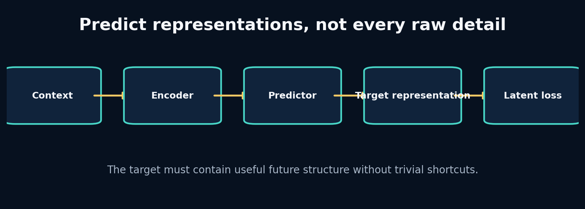

## What the picture is claiming

Understand predictive representation learning, decide when not to reconstruct raw observations, and build a disciplined fine-tuning strategy.

Joint-embedding predictive architectures encode context and target views, then train a predictor to infer the target representation from context. The target encoder defines what counts as meaningful similarity. Because the loss is in representation space, the model can ignore some raw variation—if the representation has learned to ignore it.

This creates a new failure possibility: representation collapse or shortcuts. Stop-gradient/target-encoder design, masking strategy and representation diagnostics matter. In telemetry, a future-latent target could emphasize dynamics while de-emphasizing sensor noise, but it might also discard rare safety-critical events.

Fine-tuning an existing model makes sense when its input semantics, sequence structure and learned invariances transfer. Adaptation choices range from a frozen encoder plus new head, through parameter-efficient adapters, to full fine-tuning. Start with the least invasive option that can represent the domain shift, and compare against training a small model from scratch.

## Label every block

- **Representation target:** The encoded feature vector the predictor must infer. In APEX: Potential future-dynamics target instead of raw telemetry.
- **Stop gradient / target encoder:** Prevents both sides from trivially co-adapting in unstable ways. In APEX: Part of a non-collapsing predictive objective.
- **Linear probe:** A simple supervised head used to test what information a representation contains. In APEX: Measures speed, curvature, tyre or event information in latent state.
- **Fine-tuning:** Adapt pretrained parameters to a new domain/task. In APEX: Possible when a relevant sequence/world model checkpoint exists.

## Walk one value through it

Compare two losses for target vector `y=[10.0, 0.02]` where the second feature is pure noise. Prediction A is `[9.8, 0.50]`; prediction B is `[9.8, −0.40]`. Raw MSE differs because of noise.

If a target encoder maps both raw targets to a dynamics representation `[speed_bin=10, regime=straight]`, their representation loss can be identical. This is desirable only if the discarded noise truly has no predictive or decision value.

For fine-tuning, suppose a pretrained encoder has one million parameters. A frozen-head experiment trains 5,000 parameters; an adapter trains 50,000; full tuning changes all million. These are nested hypotheses about how much the representation must change.

Now repeat the trace using one value from the packaged lab. Write its shape and unit before and after every transformation. If a block contains a learned model, distinguish its parameters from its temporary activation/state.

## What crosses each arrow?

Use this checklist:

- persistent state or temporary activation;
- observation, action, context, target or identifier;
- raw or normalized units;
- deterministic value or distribution parameters/sample;
- training-time evidence or deployment-time evidence;
- in-memory tensor or durable artifact reference.

## Break one arrow

Train both context and target encoders with no asymmetry or variance checks until they output nearly constant vectors. Observe low latent loss and useless probes.

The first visible symptom may occur several blocks later. The debugging objective is to identify the earliest arrow whose actual contract differs from the diagram.

## Choosing a different route

- **Raw reconstruction:** choose when exact observation generation or interpretable state recovery matters. Avoid when unpredictable detail dominates and decisions depend on abstract dynamics.
- **Predictive latent loss:** choose when future-relevant representation is the main goal. Avoid when you cannot validate what information the latent discarded.
- **Frozen pretrained encoder:** choose when source and target semantics align and data are limited. Avoid when the representation lacks essential f1 variables.

## APEX implementation map

```text
labs/15_autoencoder/solution.py
apex_engine/src/apexsim/models/
apex_engine/src/apexsim/evaluation.py
research_reading/
```

Open those files and redraw the diagram with exact function names and tensor shapes. Then add one missing production block—validation, logging, registry, monitoring or UI provenance—that the conceptual diagram intentionally omits.

## Explain it without vocabulary

Explain the plate to a five-year-old using objects moving through boxes. Then explain it to an engineer using contracts, shapes, units and failure modes. If both explanations are accurate, the idea is becoming durable.


# Plate 17: 17. Evaluation, Ablation and Out-of-Distribution Testing

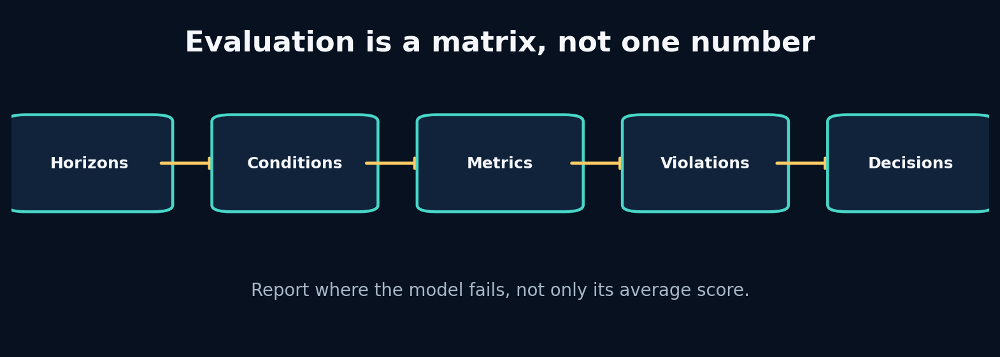

## What the picture is claiming

Build an evaluation matrix that reveals where a world model works, why it works, and when it should refuse to be trusted.

Evaluation begins with the decision. If a race engineer uses the simulator to compare a six-second throttle scenario, horizon-six causal sensitivity and physical validity matter more than one-step average fit. Metrics are measurements of requirements, not a scoreboard detached from use.

Ablation removes or changes one information source while holding other factors fixed. It answers causal questions about the implementation: Does weather context help? Does VH-like second channel—here, perhaps curvature or tyre age—matter? Randomly changing many settings answers nothing cleanly.

Out-of-distribution tests define shifts deliberately: unseen track, heavier rain, longer tyre age, unusual controls, different sample rate. Failure under OOD is expected; the goal is to detect and quantify it, then decide whether to abstain, retrain or constrain use.

## Label every block

- **Horizon metric:** Error measured separately at each future step. In APEX: Defines useful simulation duration.
- **Guardrail metric:** A metric that must remain within a safety/validity limit even if primary error improves. In APEX: Negative speed, progress bounds and control sensitivity.
- **Ablation:** A controlled removal or replacement testing one hypothesis. In APEX: State-only, no weather, no geometry, model-family comparisons.
- **OOD test:** Evaluation under a deliberately shifted distribution. In APEX: Unseen circuits, weather or control regimes.

## Walk one value through it

Suppose Model A and B have:

| Metric | A | B |
|---|---:|---:|
| 1-step MAE | 0.4 | 0.5 |
| 20-step MAE | 8.0 | 5.0 |
| Negative-speed rate | 2% | 0% |
| Scenario latency | 30 ms | 12 ms |

If the UI serves 20-step scenarios, B is stronger despite worse one-step fit. If only one-step filtering is needed, A may be acceptable if violations are constrained. The “best model” is a vector of requirement tradeoffs plus thresholds, not one scalar.

Now repeat the trace using one value from the packaged lab. Write its shape and unit before and after every transformation. If a block contains a learned model, distinguish its parameters from its temporary activation/state.

## What crosses each arrow?

Use this checklist:

- persistent state or temporary activation;
- observation, action, context, target or identifier;
- raw or normalized units;
- deterministic value or distribution parameters/sample;
- training-time evidence or deployment-time evidence;
- in-memory tensor or durable artifact reference.

## Break one arrow

Average all horizons and all conditions into one MAE. Then remove weather from inputs but accidentally change random seed and training epochs too.

The first visible symptom may occur several blocks later. The debugging objective is to identify the earliest arrow whose actual contract differs from the diagram.

## Choosing a different route

- **MAE/RMSE:** choose when continuous state error in interpretable units. Avoid when they are the only evidence for a simulator.
- **Horizon curves:** choose when autoregressive use or planning matters. Avoid when never; at least inspect them for rollouts.
- **Physical penalties:** choose when known invalid regions can be expressed and monitored. Avoid when they replace empirical outcome evaluation.

## APEX implementation map

```text
apex_engine/src/apexsim/evaluation.py
apex_engine/src/apexsim/pipeline/stages.py
apex_engine/artifacts/runs/
field_workbook/
```

Open those files and redraw the diagram with exact function names and tensor shapes. Then add one missing production block—validation, logging, registry, monitoring or UI provenance—that the conceptual diagram intentionally omits.

## Explain it without vocabulary

Explain the plate to a five-year-old using objects moving through boxes. Then explain it to an engineer using contracts, shapes, units and failure modes. If both explanations are accurate, the idea is becoming durable.


# Plate 18: 18. Planning With MPC and the Cross-Entropy Method

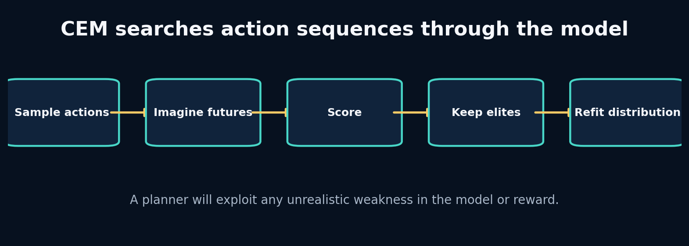

## What the picture is claiming

Use a world model to compare action sequences, understand CEM search, and learn why planners exploit model and reward defects.

Model predictive control repeatedly plans over a finite horizon, executes only the first action, observes the new state, and replans. This feedback limits drift compared with committing to a long open-loop sequence.

The cross-entropy method maintains a distribution over action sequences. It samples candidates, rolls them through the model, keeps an elite fraction, and refits mean/variance toward those elites. Repetition concentrates search around high-scoring actions.

Planner quality is bounded by world-model validity and reward completeness. Optimization pressure finds loopholes humans do not notice in average evaluation. Therefore planning tests should include adversarial actions, uncertainty penalties, constraints and real-environment verification before control is trusted.

## Label every block

- **Model predictive control:** Plan over a horizon, execute a short prefix, observe, and replan. In APEX: Future scenario/strategy layer after dynamics validation.
- **CEM:** Sampling optimizer that iteratively refits an action distribution to elite candidates. In APEX: Simple derivative-free planner through imagined telemetry.
- **Reward model:** Function scoring predicted trajectories for the decision objective. In APEX: Could combine progress, stability, tyre use and constraint penalties.
- **Model exploitation:** Planner finds actions that score well because the learned model is wrong. In APEX: A major risk under unusual controls.

## Walk one value through it

Suppose CEM samples 500 six-step throttle sequences. It scores final-speed error to a target plus smoothness. It keeps 50 elites (top 10%). New mean and standard deviation are the elite sample statistics.

If initial mean is 0.5 and standard deviation 0.3, one iteration may shift the early-step means toward 0.8 where acceleration helps. After several iterations variance shrinks. Too-rapid variance collapse can trap search; a minimum standard deviation preserves exploration.

MPC then applies only the first action, receives new evidence and replans. The remaining five actions are proposals, not a fixed command commitment.

Now repeat the trace using one value from the packaged lab. Write its shape and unit before and after every transformation. If a block contains a learned model, distinguish its parameters from its temporary activation/state.

## What crosses each arrow?

Use this checklist:

- persistent state or temporary activation;
- observation, action, context, target or identifier;
- raw or normalized units;
- deterministic value or distribution parameters/sample;
- training-time evidence or deployment-time evidence;
- in-memory tensor or durable artifact reference.

## Break one arrow

Remove the smoothness term and allow throttle beyond one. Add a model region where extreme throttle incorrectly increases speed without penalty. Watch CEM discover it.

The first visible symptom may occur several blocks later. The debugging objective is to identify the earliest arrow whose actual contract differs from the diagram.

## Choosing a different route

- **Grid search:** choose when action space and horizon are tiny. Avoid when combinatorial sequences.
- **CEM:** choose when continuous bounded actions, no gradients required and batch rollout is cheap. Avoid when model evaluations are extremely expensive or multi-modal search collapses.
- **Gradient planning:** choose when world model/reward are differentiable and smooth. Avoid when discrete actions, poor local optima or unstable gradients.

## APEX implementation map

```text
labs/18_cem_planning/solution.py
projects/09_latent_mpc/main.py
apex_engine/src/apexsim/simulation.py
debugging_cases/12_planner_exploitation
```

Open those files and redraw the diagram with exact function names and tensor shapes. Then add one missing production block—validation, logging, registry, monitoring or UI provenance—that the conceptual diagram intentionally omits.

## Explain it without vocabulary

Explain the plate to a five-year-old using objects moving through boxes. Then explain it to an engineer using contracts, shapes, units and failure modes. If both explanations are accurate, the idea is becoming durable.


# Plate 19: 19. Production Pipelines, Airflow, Registry and Monitoring

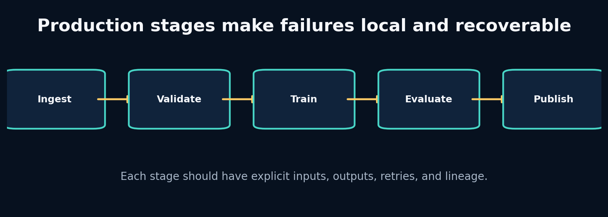

## What the picture is claiming

Refactor experimental code into idempotent stages with observable lineage, then understand when orchestration becomes necessary.

A stage has explicit inputs, outputs, configuration, failure modes and idempotency policy. Ingestion writes canonical data; validation writes a report; training writes a checkpoint; evaluation writes metrics; publication writes UI/API products. Each artifact is immutable within a run and linked by identifiers/hashes.

Airflow schedules and tracks task dependencies, retries and backfills. Business logic should remain in ordinary tested Python functions so the same stage runs locally, in tests and under orchestration. Passing large arrays through orchestration metadata is a smell; pass durable artifact references.

A registry records runs, configurations, dataset versions, metrics and status. Monitoring then covers pipeline health, data drift, model behaviour and product delivery. Logging without stable run IDs and structured fields is not lineage.

## Label every block

- **Idempotency:** Repeating a stage with the same inputs yields the same result or safely reuses it. In APEX: Enables retries and backfills.
- **Artifact lineage:** Trace which data, code and configuration produced an output. In APEX: Every UI prediction links to model run and dataset.
- **Orchestrator:** Coordinates when stages run and how failures/retries are managed. In APEX: Airflow DAG wraps tested stage functions.
- **Registry:** Queryable record of runs, statuses, metrics and artifact locations. In APEX: SQLite V1, expandable to a service/database.

## Walk one value through it

Assume training checkpoint hash `abc123` exists and evaluation failed because disk was temporarily full.

A safe retry checks:

1. Same run ID and immutable configuration hash.
2. Same dataset/normalizer hashes.
3. Checkpoint exists, is complete and matches metadata.
4. Training stage status is succeeded.
5. Evaluation output is absent or marked failed.

Then retry evaluation only. If configuration changed, create a new run rather than silently reusing the checkpoint. If checkpoint integrity is uncertain, retrain in a new or repaired stage path.

Now repeat the trace using one value from the packaged lab. Write its shape and unit before and after every transformation. If a block contains a learned model, distinguish its parameters from its temporary activation/state.

## What crosses each arrow?

Use this checklist:

- persistent state or temporary activation;
- observation, action, context, target or identifier;
- raw or normalized units;
- deterministic value or distribution parameters/sample;
- training-time evidence or deployment-time evidence;
- in-memory tensor or durable artifact reference.

## Break one arrow

Write every run to `latest/`, pass a large tensor through Airflow XCom, and combine ingestion/training/publication in one task. Simulate a publication failure.

The first visible symptom may occur several blocks later. The debugging objective is to identify the earliest arrow whose actual contract differs from the diagram.

## Choosing a different route

- **Local Python runner:** choose when development, ci and small reproducible workflows. Avoid when complex schedules, backfills and multi-worker operations.
- **Airflow:** choose when batch dependencies, retries, schedules and historical backfills matter. Avoid when you need low-latency event streaming or have only one trivial script.
- **Experiment tracker:** choose when comparing many model runs and artifacts. Avoid when you assume it replaces data/version contracts and orchestration.

## APEX implementation map

```text
apex_engine/src/apexsim/pipeline/stages.py
apex_engine/src/apexsim/pipeline/runner.py
apex_engine/src/apexsim/registry.py
apex_engine/dags/apexsim_dag.py
debugging_cases/13_artifact_overwrite
debugging_cases/14_airflow_payload
```

Open those files and redraw the diagram with exact function names and tensor shapes. Then add one missing production block—validation, logging, registry, monitoring or UI provenance—that the conceptual diagram intentionally omits.

## Explain it without vocabulary

Explain the plate to a five-year-old using objects moving through boxes. Then explain it to an engineer using contracts, shapes, units and failure modes. If both explanations are accurate, the idea is becoming durable.


# Plate 20: 20. Build Project APEX V1 End to End—and Then Outgrow It

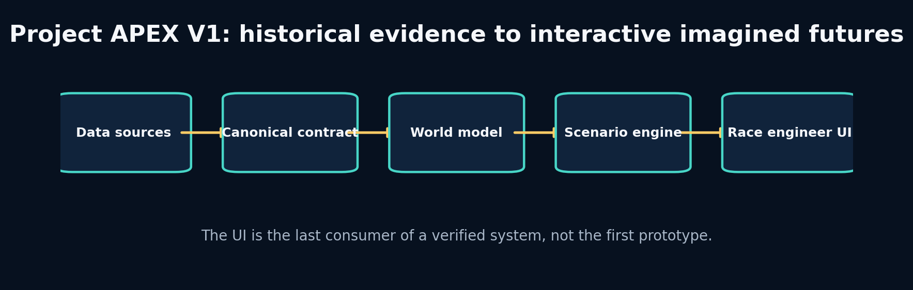

## What the picture is claiming

Assemble the complete system, run a verified world-model simulation, use the UI responsibly, and define the research path toward F1 25 and an original architecture.

APEX V1 is a historical telemetry world-simulation engine. It does not claim complete car physics or autonomous strategy. It answers a narrower, testable question: given recent canonical telemetry and an explicit sequence of future controls/context, can a learned transition model generate plausible short-horizon future state?

The system begins with synthetic data so every causal rule is inspectable and offline tests always run. It accepts FastF1/OpenF1 canonical data when available. A deterministic GRU is primary; an SSM-style model and RSSM are challengers. Evaluation determines the trusted horizon. The scenario engine modifies only designated future controls/context. The UI displays recorded and imagined trajectories with model/run identity and limitations.

The next stages are research, not feature accumulation: improve state observability, calibrate uncertainty, add track/generalization splits, ingest F1 25 UDP, learn richer latent dynamics, and validate planning. An original architecture should be proposed only after a measured failure cannot be fixed by data, objective or simpler model choices.

## Label every block

- **Scenario contract:** Exactly which future controls/context may be changed and how. In APEX: Throttle, brake, rain/grip and tyre assumptions under bounded transformations.
- **Trusted horizon:** Maximum forecast duration meeting error and guardrail criteria. In APEX: Displayed with every scenario rather than claiming unlimited simulation.
- **Product provenance:** User-visible link from prediction to run/model/data/config. In APEX: Prevents anonymous, irreproducible UI output.
- **Research hypothesis:** A falsifiable explanation for a measured failure and proposed change. In APEX: The basis for new world-model architecture work.

## Walk one value through it

A UI scenario uses history length 32 at 5 Hz (6.4 seconds) and predicts 8 frames (1.6 seconds). Suppose speed MAE by horizon is `[1.0,1.3,1.8,2.5,3.4,4.6,6.2,8.5] km/h`, with a guardrail of MAE ≤5 km/h and zero physical violations. The trusted horizon is step 6, or 1.2 seconds, even though the model emits 1.6 seconds.

This is not failure. The system should shade or label steps 7–8 as exploratory, refuse high-stakes conclusions, and direct research toward the compounding error observed after step 6.

Now repeat the trace using one value from the packaged lab. Write its shape and unit before and after every transformation. If a block contains a learned model, distinguish its parameters from its temporary activation/state.

## What crosses each arrow?

Use this checklist:

- persistent state or temporary activation;
- observation, action, context, target or identifier;
- raw or normalized units;
- deterministic value or distribution parameters/sample;
- training-time evidence or deployment-time evidence;
- in-memory tensor or durable artifact reference.

## Break one arrow

Load a checkpoint with the wrong normalizer, let the UI modify future target speed directly, hide the model identity, or display more decimal precision than validation supports.

The first visible symptom may occur several blocks later. The debugging objective is to identify the earliest arrow whose actual contract differs from the diagram.

## Choosing a different route

- **Gradio UI:** choose when rapid educational interactive scenarios with python integration. Avoid when you require a highly customized production frontend at scale.
- **FastAPI + web frontend:** choose when stable service contracts, multiple clients and custom ux. Avoid when the api/model contract is still changing daily.
- **Synthetic-first:** choose when offline causality, testing and controlled failure injection. Avoid when you confuse synthetic accuracy with real f1 fidelity.

## APEX implementation map

```text
apex_engine/START_HERE.md
apex_engine/src/apexsim/
apex_engine/notebooks/
apex_engine/tests/
projects/10_project_apex/
source_code_companion/
```

Open those files and redraw the diagram with exact function names and tensor shapes. Then add one missing production block—validation, logging, registry, monitoring or UI provenance—that the conceptual diagram intentionally omits.

## Explain it without vocabulary

Explain the plate to a five-year-old using objects moving through boxes. Then explain it to an engineer using contracts, shapes, units and failure modes. If both explanations are accurate, the idea is becoming durable.

